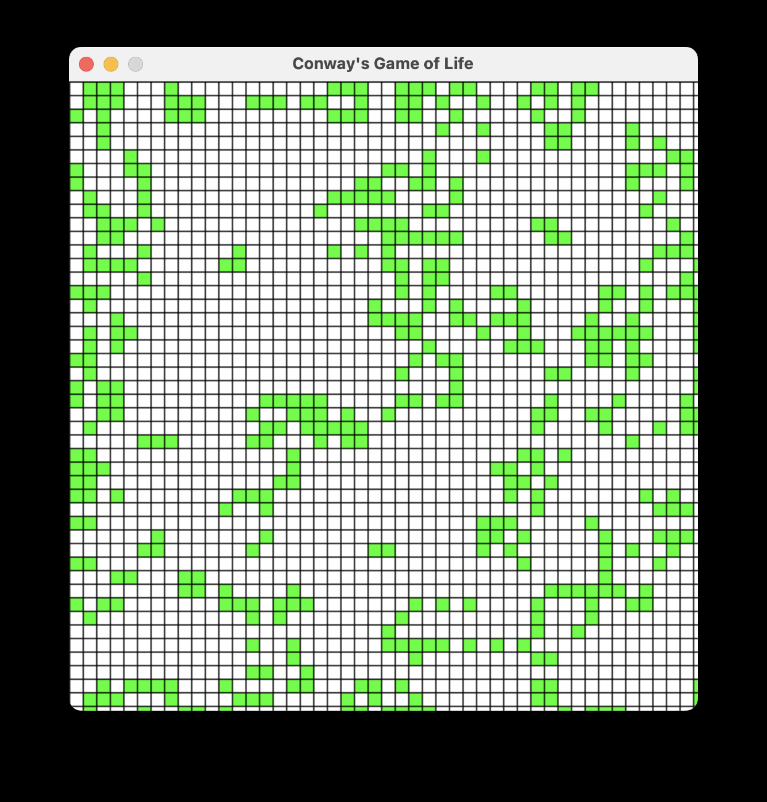

# Nocode Conway's Game Of Life

```
/*

This is a repo where I only write the comments. All the code is from Copilot.

Initial browser version here:

*/
```

[https://bmount.github.io/nocode-game-of-life/](https://bmount.github.io/nocode-game-of-life/)

```
/*
Second version is python, using pygame, which I had never tried. I think I may have deleted
a few of the comments toward the end and written a function name (maybe). But no code.

Copilot also created the Makefile (or all the parts that weren't comments.) This can
lead to eg very verbose .gitignore rules (but pretty good.) The idea is that everything
runnable is coming from an LLM.

You should be able to use this makefile to install dependencies and run the python version.

*/
```

